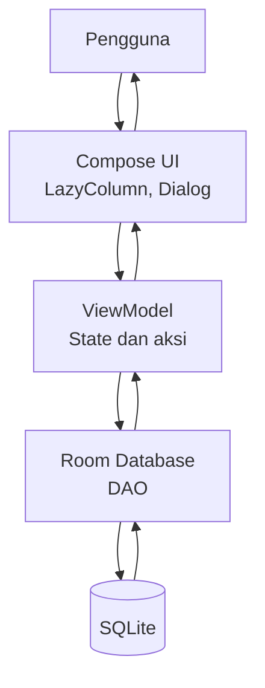
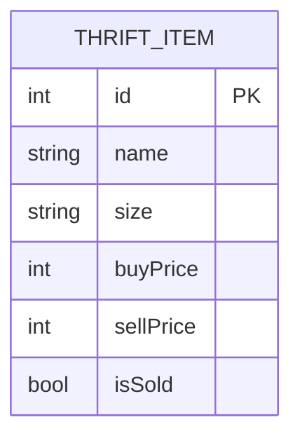

# PRD — Project Requirements Document

## 1. Overview
Toko pakaian thrift sering kesulitan mencatat stok secara manual, sehingga rawan salah, tidak rapi, dan data mudah hilang. Aplikasi ini adalah aplikasi Android sederhana untuk mengelola inventaris pakaian thrift. Pengguna dapat membuat daftar pakaian, melihat semua item dalam satu layar, mengubah detail, menandai status terjual, dan menghapus item yang tidak diperlukan.

Tujuan utama aplikasi adalah membantu pemilik toko mencatat stok dengan cepat dan mudah, tanpa ribet. Semua data disimpan langsung di perangkat menggunakan Room Database, sehingga catatan tidak hilang meskipun aplikasi ditutup. Aplikasi dibangun menggunakan Kotlin dan Jetpack Compose tanpa XML, dengan kode yang sederhana dan mudah dipahami oleh developer pemula.

## 2. Requirements
- Platform: Android, dibangun menggunakan Android Studio.
- Bahasa pemrograman: Kotlin.
- UI: 100% Jetpack Compose, tanpa XML untuk layout.
- Database: Room Database (SQLite) untuk penyimpanan lokal.
- Mendukung operasi CRUD: Create (tambah), Read (lihat), Update (ubah), Delete (hapus).
- Data harus tersimpan otomatis dan tetap ada setelah aplikasi ditutup.
- Kode harus bersih, sederhana, dan diberi komentar agar mudah dipelajari pemula.
- Tidak membutuhkan backend atau koneksi internet; semua data lokal di perangkat.

## 3. Core Features

### Fase 1 — Daftar Barang
- **Daftar Barang** — Menampilkan semua pakaian thrift dalam satu layar utama.
  - **Lihat item** — Setiap item menampilkan nama, ukuran, harga, dan status pakaian.
  - **Status terjual** — Setiap pakaian ditandai sebagai Tersedia atau Terjual.

### Fase 2 — Kelola Barang
- **Tambah Barang** — Menambahkan pakaian thrift baru ke dalam inventaris.
  - **Isi data** — Memasukkan nama, ukuran, harga beli, dan harga jual.
  - **Simpan item** — Item baru tersimpan dan langsung muncul di daftar.
- **Ubah Barang** — Mengubah detail item atau menandai status terjual.
  - **Edit detail** — Memperbarui nama, ukuran, atau harga item.
  - **Tandai terjual** — Mengubah status item menjadi Terjual atau kembali Tersedia.
  - **Simpan perubahan** — Hasil edit langsung tersimpan dan muncul di daftar.
- **Hapus Barang** — Menghapus item yang tidak diperlukan dari daftar.
  - **Tombol hapus** — Setiap kartu item memiliki tombol hapus.
  - **Konfirmasi hapus** — Muncul konfirmasi sebelum item dihapus dari database.

### Fase 3 — Data Tetap Ada
- **Data Tetap Ada** — Semua catatan tersimpan di perangkat dan tidak hilang.
  - **Tersimpan otomatis** — Setiap tambah, ubah, atau hapus langsung disimpan ke database.
  - **Aman saat ditutup** — Data tetap ada walau aplikasi ditutup atau perangkat di-restart.

## 4. User Flow
1. Pengguna membuka aplikasi dan langsung melihat daftar semua pakaian thrift dalam bentuk kartu.
2. Untuk menambah barang, tekan tombol FAB (ikon +) di layar utama.
3. Sebuah dialog atau bottom sheet terbuka berisi form nama, ukuran, harga beli, dan harga jual.
4. Setelah mengisi data, tekan **Simpan**. Item baru langsung masuk ke database dan muncul di daftar.
5. Untuk mengubah item, pengguna mengetuk salah satu kartu item.
6. Dialog edit terbuka. Pengguna dapat memperbarui nama, ukuran, harga, atau toggle status terjual.
7. Tekan **Simpan**, perubahan langsung tersimpan dan daftar diperbarui.
8. Untuk menghapus, tekan ikon hapus pada kartu item.
9. Muncul dialog konfirmasi. Jika disetujui, item dihapus dari daftar dan database.
10. Saat aplikasi ditutup dan dibuka kembali, semua data tetap ada karena tersimpan di Room Database.

## 5. Architecture
Aplikasi menggunakan pola sederhana: UI menampilkan data dan menerima aksi dari pengguna, ViewModel mengelola state, dan Room Database menangani penyimpanan lokal. Alur berjalan satu arah sehingga mudah dipahami dan dikembangkan.

Penjelasan alur:
- UI Compose menampilkan daftar item dan menerima input dari pengguna.
- Pengguna menekan tombol seperti tambah, edit, hapus, atau toggle status.
- ViewModel menerima aksi tersebut dan memanggil fungsi DAO.
- DAO membaca atau menulis data ke database SQLite.
- Setelah data berubah, ViewModel memperbarui state dan UI otomatis menampilkan daftar terbaru.

## 6. Database Schema
Aplikasi membutuhkan satu tabel bernama `thrift_items` untuk menyimpan semua data pakaian thrift.

| Kolom | Tipe | Keterangan |
|-------|------|------------|
| id | Int | Primary key, diisi otomatis oleh Room |
| name | String | Nama pakaian, contoh: "Vintage Nike Hoodie" |
| size | String | Ukuran pakaian, contoh: "M", "L", "XL" |
| buyPrice | Int | Harga beli dari supplier |
| sellPrice | Int | Harga jual ke pembeli |
| isSold | Boolean | Status barang, default `false` (Tersedia) |

Catatan:
- `id` dibuat otomatis, sehingga pengguna tidak perlu mengisinya.
- `isSold` default bernilai `false` saat item pertama kali dibuat.
- Harga disimpan sebagai angka bulat dalam Rupiah.

## 7. Tech Stack
- **Bahasa**: Kotlin
- **UI**: Jetpack Compose + Material 3
- **Layout**: 100% Compose, tanpa XML
- **Architecture**: ViewModel + StateFlow
- **Database**: Room Database (SQLite)
- **Minimal SDK**: 24 (Android 7.0) atau lebih tinggi
- **Build tool**: Gradle dengan Android Studio
- **Dependency utama**:
  - `androidx.activity:activity-compose`
  - `androidx.compose.material3:material3` (via Compose BOM)
  - `androidx.lifecycle:lifecycle-viewmodel-compose`
  - `androidx.room:room-runtime`
  - `androidx.room:room-ktx`
  - `androidx.room:room-compiler`

Aplikasi ini berjalan sepenuhnya offline di perangkat Android. Tidak ada server, backend, atau layanan cloud pada versi awal. Semua data tersimpan di dalam Room Database lokal.